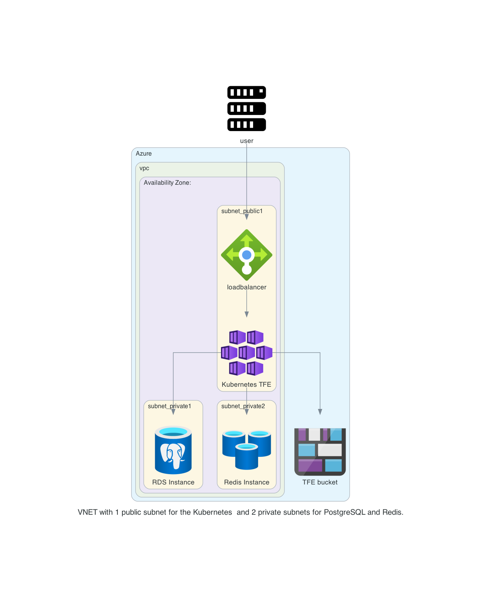

# Creating a TFE external installation on Kubernetes - Azure with MSI Redis Authentication

With this repository you will install a Terraform Enterprise environment on a Azure Kubernetes cluster (AKS) using Terraform. This example demonstrates how to configure TFE to authenticate to Azure Redis Cache using Managed Service Identity (MSI) instead of access keys. Kubernetes only supports an active-active configuration with an external Redis database. 


# Creating the infrastructure

We create the infrastructure according to the following diagram for the kubernetes environment. This setup includes Azure Redis Cache with Entra ID authentication enabled and Managed Service Identity (MSI) configuration for passwordless authentication from TFE pods.

  

# Prerequisites
## AWS
We will be using AWS for creating the DNS records. 

## Azure
Make sure you have an Azure account. Please make sure the az cli tool is installed and confired to get the AKS configuration downloaded

## Install terraform  
See the following documentation [How to install Terraform](https://learn.hashicorp.com/tutorials/terraform/install-cli)

## kubectl
Make sure kubectl is available on your system. Please see the documentation [here](https://kubernetes.io/docs/tasks/tools/).

## helm
Make sure helm is available on your system. Please see the documentation [here](https://helm.sh/docs/intro/install/)

# How to

- Clone this repository
```
https://github.com/munnep/tfe_fdo_azure_external_kubernetes_redis_msi
```
- Set your AWS credentials
```
export AWS_ACCESS_KEY_ID=
export AWS_SECRET_ACCESS_KEY=
export AWS_SESSION_TOKEN=
```

## Now you will need to create the infrastructure for AKS
- Go into the directory `tfe_fdo_azure_external_kubernetes_redis_msi/infra`
```
cd tfe_fdo_aws_external_kubernetes/infra
```
- Create a file called `variables.auto.tfvars` with the following contents
```
# General
tag_prefix        = "tfe19"                                            # General prefix used in the code and naming
# Azure    
vnet_cidr         = "10.211.0.0/16"                                    # Network for the VPC to be created
postgres_user     = "tfe"                                              # Postgres user to be used 
postgres_password = "Password#1"                                       # Password for the postgres user
storage_account   = "tfe19patrick"                                     # Name of the storage account to be created which should be unique
subscription_id   = "c58f91c0-ac20-42fe-982f-xxxxxxx"                  # subscription ID
``````
- Initialize terraform
```
terraform init
```
- Create the Azure resources
```
terraform apply
```
- The output should be the following
```
Apply complete! Resources: 24 added, 0 changed, 0 destroyed.

Outputs:

cluster_name = "tfe19"
container_name = "tfe19-container"
kubernetes_configuration = "az aks get-credentials --resource-group tfe19 --name tfe19"
pg_address = "tfe19-psqlflexibleserver.postgres.database.azure.com"
pg_dbname = "tfe"
pg_password = <sensitive>
pg_user = "tfe"
prefix = "tfe19"
redis_host = "tfe19-redis.redis.cache.windows.net"
redis_port = 6379
redis_primary_access_key = <sensitive>
storage_account = "tfe19patrick"
storage_account_key = <sensitive>
tfe_redis_managed_identity_name = "tfe19-tfe-aks-msi"
tfe_redis_passwordless_azure_client_id = <sensitive>
tfe_redis_user = <sensitive>
```
- The kubernetes environment is created from an infrastructure standpoint.   

## Now you will need to deploy Terraform Enterprise on to this cluster

- Go to the directory `../tfe`
```
cd ../tfe
```
- Create a file called `variables.auto.tfvars` with the following contents
```
dns_hostname               = "tfe19"                                   # Hostname used for TFE
dns_zonename               = "aws.munnep.com"                          # DNS zone where the hostname record can be created
certificate_email          = "patrick.munne@hashicorp.com"             # email address used for creating valid certificates
tfe_encryption_password    = "Password#1"                              # encryption key used by TFE
replica_count              = 1                                         # Number of replicas for TFE you would like to have started
tfe_license                = "<your_tfe_license_raw_text>"             # Your TFE license in raw text
tfe_release                = "1.0.1"                               # The version of TFE application you wish to be deployed   
load_balancer_type         = "external"                                # If you would like to have an "internal" or "external" loadbalancer
# AWS
region                     = "eu-north-1"                              # To create the DNS record on AWS     
# Azure
subscription_id   = "c58f91c0-ac20-42fe-982f-xxxxxxx"                  # subscription ID
```
- Initialize the environment
```
terraform init
```
- Create the environment
```
terraform apply
```
- This will create 6 resources
```
Apply complete! Resources: 7 added, 0 changed, 0 destroyed.

Outputs:

execute_script_to_create_user_admin = "./configure_tfe.sh tfe19.aws.munnep.com patrick.munne@hashicorp.com Password#1"
tfe_application_url = "https://tfe19.aws.munnep.com"
```
- Execute the `configure_tfe.sh tfe19.aws.munnep.com patrick.munne@hashicorp.com Password#1` script to do the following
  - Create a user called admin with the password specified
  - Create an organization called test
- login to the application on url https://tfe19.aws.munnep.com

